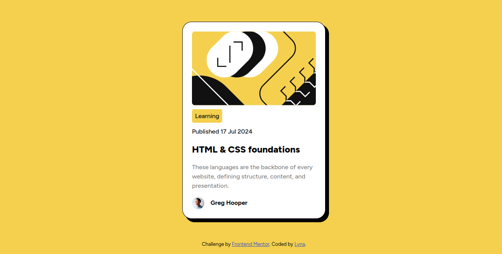

# Frontend Mentor - Blog preview card solution

This is a solution to the [Blog preview card challenge on Frontend Mentor](https://www.frontendmentor.io/challenges/blog-preview-card-ckPaj01IcS).

## Table of contents

- [Overview](#overview)
  - [The challenge](#the-challenge)
  - [Screenshot](#screenshot)
  - [Links](#links)
- [My process](#my-process)
  - [Built with](#built-with)
  - [What I learned](#what-i-learned)
  - [Continued development](#continued-development)
  - [Useful resources](#useful-resources)
- [Author](#author)
- [Acknowledgments](#acknowledgments)

## Overview

### The challenge

Users should be able to:

- See hover and focus states for all interactive elements on the page

### Screenshot




### Links

- Solution URL: [Frontend Mentor - Blog preview card solution](https://your-solution-url.com)
- Live Site URL: [Frontend Mentor - Blog preview card solution](https://lynaifr.github.io/blog-preview-card-main/)

## My process

### Built with

- Semantic HTML5 markup
- CSS custom properties
- Flexbox
- @face-font

### What I learned

flexbox is a great tool to place elements in a website, I used it to center the card by setting it in its parent ```.container```, same thing for the elements in the card as follows:
```css
  .card{
    width: auto;
    max-width: 20rem;
    height: auto;
    margin: auto;
    padding: 1.5rem;
    display: flex;
    flex-direction: column;
    gap: 1rem;
  }
```

### Continued development

I still need to focus on the different HTML5 tags and what CSS styles go with it. 

### Useful resources

- [How to center a div](https://builtin.com/articles/center-div-horizontally-and-vertically) - This helped me better understand how to use flexbox properties.

## Author

- Website - [Lyna](https://lynaifr.github.io/blog-preview-card-main/)
- Frontend Mentor - [@yourusername](https://www.frontendmentor.io/profile/yourusername)